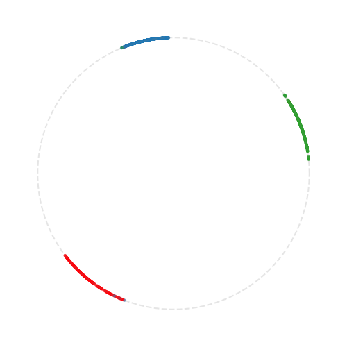
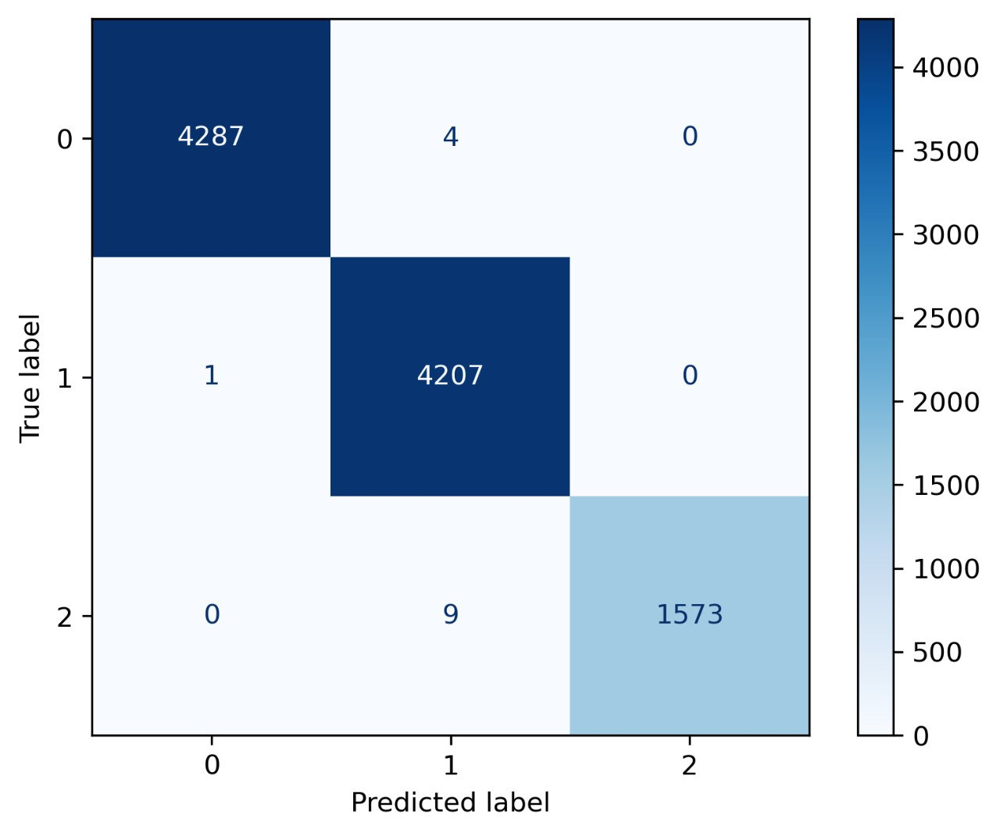

# Multilingual Text Classifier — Supervised Contrastive Learning + Transfer Learning

<p align="center">
  
  &nbsp;&nbsp;&nbsp;
  
</p>

<p align="center">
  
  
  
  
  
</p>

---

A production-ready, two-stage NLP pipeline for multilingual text classification. Built on **XLM-RoBERTa** with **Supervised Contrastive Learning** (Khosla et al., NeurIPS 2020) — validated on 10,081 samples with **99.86% overall accuracy**.

---

## Results

| Class | Correct | Total | Precision |
|---|---|---|---|
| Class 0 | 4287 | 4291 | **99.9%** |
| Class 1 | 4207 | 4208 | **99.98%** |
| Class 2 (minority) | 1573 | 1582 | **99.4%** |
| **Overall** | **10067** | **10081** | **99.86%** |

> Minority class handled via augmentation and class-weighted loss — no class was sacrificed for aggregate accuracy.

---

## Motivation

Standard fine-tuning on imbalanced, multilingual text often produces fragile representations — the model memorizes surface patterns rather than learning robust semantic structure. This is especially problematic when:

- The dataset is **multilingual** (English + Russian mixed)
- One class is **significantly underrepresented**
- The task requires **generalization**, not just high aggregate accuracy

Our solution: train the encoder first to produce geometrically structured embeddings via **Supervised Contrastive Loss**, then transfer those representations to a lightweight classifier.

---

## Architecture

The pipeline consists of two independent training stages:

```
Raw Text
   │
   ▼
┌─────────────────────────────────┐
│  PII Cleaner                    │
│  emails → <EMAIL>               │
│  URLs   → <URL>                 │
│  dates  → <DATE>   etc.         │
└────────────────┬────────────────┘
                 │
                 ▼
┌─────────────────────────────────┐
│  XLM-RoBERTa Tokenizer          │
│  + custom special tokens        │
└────────────────┬────────────────┘
                 │
    ┌────────────▼────────────┐
    │   STAGE 1               │
    │   SupCon Encoder        │
    │   XLM-RoBERTa-base      │
    │   + Projection Head     │
    │   Loss: SupConLoss      │
    │   Sampler: MPerClass    │
    │   Aug: minority repeat  │
    └────────────┬────────────┘
                 │  (encoder weights saved)
    ┌────────────▼────────────┐
    │   STAGE 2               │
    │   Frozen Encoder        │
    │   + Mean Pooler         │
    │   + Classifier Head     │
    │   Loss: WeightedCE      │
    └────────────┬────────────┘
                 │
                 ▼
            Category
```

### Stage 1 — Representation Learning

The encoder is trained with **Supervised Contrastive Loss** — a metric learning objective that pulls same-class embeddings together and pushes different-class embeddings apart, without requiring a classification head at this stage.

Key design choices:
- **MPerClassSampler** — ensures M samples per class per batch, stabilizing contrastive training on imbalanced data
- **Minority class augmentation** — the underrepresented class is repeated K times per batch (K = `max_class_size / minority_class_size`), preventing collapse
- **Warmup + Cosine Annealing** — LR warmup for 2 steps, then cosine decay with `η_min = 1e-5`
- **Gradient checkpointing + bfloat16 autocast** — memory-efficient training on long sequences (up to 512 tokens)

Training metrics logged per step to MLflow:
- `loss` — SupCon loss value
- `gradient norm` — for detecting instability
- `alignment` — intra-class cohesion (Wang & Isola, ICML 2020)
- `uniformity` — inter-class spread on the unit hypersphere

UMAP projections of the embedding space are logged every N epochs, allowing visual inspection of cluster formation throughout training (see header image — three distinct arcs = three well-separated classes).

### Stage 2 — Transfer & Classification

The pre-trained encoder is loaded, lower layers are frozen (`freeze_layers_below`), and a classification head is attached. Training uses:
- **Class-weighted Cross-Entropy** — weights inversely proportional to class frequency
- **Standard AdamW** + Cosine Annealing
- **Validation loop** — loss tracked separately for train/valid per epoch

At the end of training, a full `classification_report` and `confusion_matrix` are logged as MLflow artifacts.

---

## Visualizations

### Embedding Space (UMAP Projection)

<p align="center">
  
</p>

After Stage 1 training, we project the encoder's output embeddings to 2D using UMAP and normalize them onto the unit circle. Three tight, well-separated arcs confirm that the model has learned a geometrically structured representation — each class occupies a distinct region of the hypersphere.

This is a direct visual confirmation of high **alignment** (tight arcs = intra-class cohesion) and **uniformity** (arcs spread across the circle = inter-class separation).

### Confusion Matrix (Validation Set — 10,081 samples)

<p align="center">
  
</p>

Near-perfect diagonal dominance across all three classes, including the minority class (Class 2). Only 14 misclassifications out of 10,081 samples.

---

## Privacy by Design

All text is processed through a custom **Cleaner** before tokenization:

| Raw content | Replaced with |
|---|---|
| Email addresses | `<EMAIL>` |
| URLs / links | `<URL>` |
| Usernames / handles | `<USERNAME>` |
| Dates | `<DATE>` |
| Times | `<TIME>` |

These tokens are added to the tokenizer vocabulary and the embedding matrix is resized accordingly. **No raw PII reaches the model at any stage.**

---

## Project Structure

```
.
├── configs/
│   ├── hyperparams.yaml     # batch_size, lr, epochs, temperature, etc.
│   └── settings.yaml        # paths, device, MLflow tracking URI
├── notebooks/
│   ├── supcon-train.ipynb                  # Stage 1: base SupCon training
│   ├── supcon-train-with-augmentatio.ipynb # Stage 1: with minority augmentation
│   └── interpretation.ipynb               # UMAP visualization of embeddings
├── src/
│   ├── cleaner.py           # PII anonymization
│   ├── collate_fn.py        # Batch collation with tokenizer
│   ├── dataset.py           # PyTorch Dataset
│   ├── evaluation.py        # Embedding extraction for UMAP
│   ├── freezing.py          # Selective layer freezing utilities
│   ├── metrics.py           # Alignment & uniformity (Wang & Isola 2020)
│   ├── model.py             # XLMRoBERTaSupCon + RobertaClassifier
│   ├── pooler.py            # Mean pooling over attention mask
│   ├── settings.py          # Pydantic/YAML config loaders
│   └── training.py          # train_step with AMP + grad clipping
└── requirements.txt
```

---

## Stack

| Component | Library |
|---|---|
| Backbone | `transformers` — XLM-RoBERTa base |
| Contrastive Loss | `pytorch-metric-learning` — SupConLoss |
| Sampling | `pytorch-metric-learning` — MPerClassSampler |
| Visualization | `umap-learn`, `matplotlib` |
| Experiment Tracking | `mlflow` |
| Metrics | `scikit-learn` — classification_report, confusion_matrix |
| Training | `torch` with `autocast` (bfloat16) + gradient checkpointing |
| Config | YAML-driven via custom Pydantic settings |

---

## Scientific Foundation

This project is built directly on peer-reviewed research. Every architectural decision is backed by a paper.

### [1] Supervised Contrastive Learning
**Khosla et al., NeurIPS 2020** · [arXiv:2004.11362](https://arxiv.org/abs/2004.11362) · 7,000+ citations

> The core training objective of Stage 1. Extends self-supervised contrastive learning to the fully-supervised setting — using label information to form tighter, more semantically meaningful clusters. Produces representations that transfer better than cross-entropy fine-tuning alone.

### [2] XLM-RoBERTa: Unsupervised Cross-lingual Representation Learning at Scale
**Conneau et al., ACL 2020** · Meta AI Research

> Backbone encoder. Pretrained on 2.5TB of multilingual data across 100 languages — enabling a single model to handle mixed English/Russian text without language-specific preprocessing or separate models.

### [3] Understanding Contrastive Representation Learning through Alignment and Uniformity on the Hypersphere
**Wang & Isola, ICML 2020**

> Theoretical foundation for our per-epoch training metrics. We compute `alignment` (average distance between same-class embeddings) and `uniformity` (log-average pairwise Gaussian kernel — measures spread on the hypersphere) directly from this paper's formulations and log them to MLflow.

### [4] pytorch-metric-learning
**Musgrave et al., 2020** · [GitHub](https://github.com/KevinMusgrave/pytorch-metric-learning)

> Provides SupConLoss and MPerClassSampler. The M-per-class sampling strategy is critical for stable contrastive training on imbalanced datasets — ensures each class is equally represented in every batch.

---

## About playsdev ML Team

We are a research-driven ML team that builds production AI systems. Our workflow:

1. **Literature review first** — we read current papers on arXiv, Semantic Scholar, and Papers With Code before choosing any approach
2. **Implement from scratch** — we don't copy-paste library examples; we understand the math and implement correctly
3. **Benchmark everything** — every architectural choice is compared against a baseline
4. **Ship to production** — clean, modular, config-driven code with full experiment tracking

**Expertise:** NLP · Computer Vision · RAG Systems · MLOps · Generative AI · AI Consulting

---

*playsdev · ML Department · Available for US market engagement*
